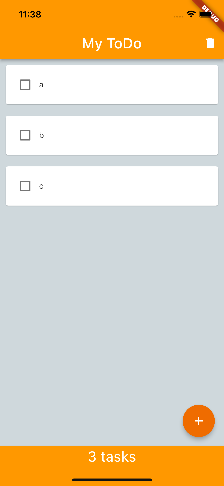
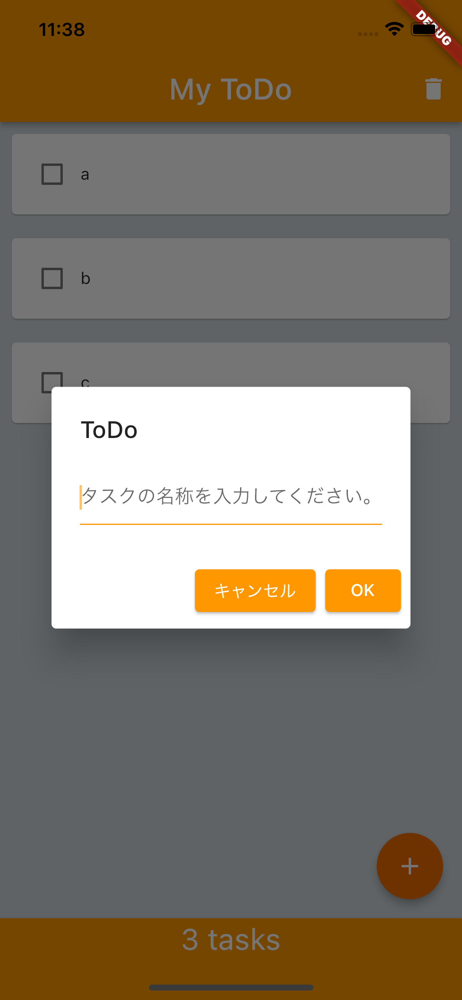

# 創造的ものづくりプロジェクト (Webサービス・アプリデザイン概論)

工学部電子情報工学科3年 03210460 水谷航悠

[GitHubリンク](https://github.com/metaphy-hub/flutter_app)

[GoogleDriveリンク](https://drive.google.com/drive/folders/1RMCuDdR21FcRbbz58JctFymq-28IkTyD?usp=sharing)
## todoリスト
公開された資料をもとに，ToDoとチェック状態が保存されるToDoリストを作成し，それを拡張して以下のようなToDoリストを作成した．

資料のToDoリストとの違いは以下の通りである．
* 中央部分の背景を暗くし，taskをより見えやすくした．
* 全体の色をオレンジに統一し，自分の好みのデザインに変更した．
* taskの数が動的に記録され，下部にいくつタスクが残っているか表示されるようにした．
* taskはデバイスに保存され，再起動しても消えることはない．これと同様に，taskの数についても，データの配列の長さを調べることで，再起動の際に正しい値が表示されるようにした．